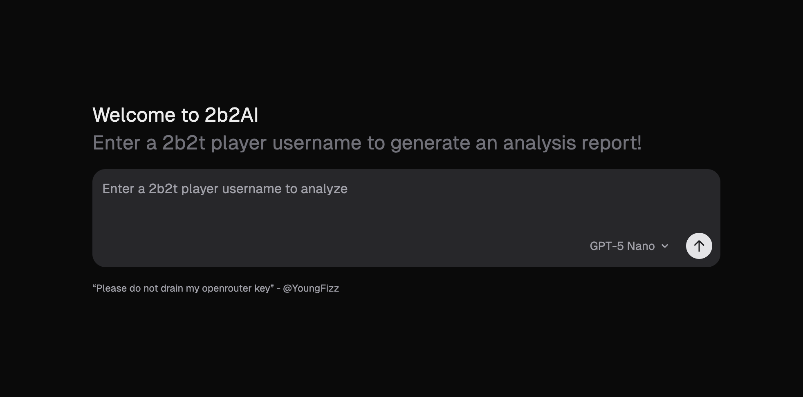

<a href="https://2b2ai.youngfizz.co.uk">
  
  <h1 align="center">2B2AI Player Summarizer</h1>
</a>

<p align="center">
  An Open-Source AI summarizer using 2b2t.vc API to summarize 2b2t chats, connections & stats to provide a report on a player.
</p>

<p align="center">
  <a href="#features"><strong>Features</strong></a> ·
  <a href="#deploy-your-own"><strong>Deploy Your Own</strong></a> ·
  <a href="#Credits"><strong>Credits</strong></a>
</p>
<br/>

## Features

- Reasoning ( Reliant on selected model/provider )
- Streaming AI responses
- 2b2t.vc API intergration
- Multiple model support
- Follow up chat support

## Deploy Your Own

You can deploy your own version of the 2B2AI with one click:

[](https://vercel.com/new/clone?repository-url=https%3A%2F%2Fgithub.com%2FYoungFizzler%2F2b2ai&env=ANTHROPIC_API_KEY,FIREWORKS_API_KEY,GROQ_API_KEY&envDescription=Anthropic%20API%20key&envLink=https%3A%2F%2Fconsole.anthropic.com%2F)

## Running locally

You will need to use the environment variables. Refer to env.example for variables needed. 

> Note: You should not commit your `.env` file or it will expose secrets that will allow others to control access to your various OpenRouter and authentication provider accounts.

```bash
pnpm install
pnpm dev
```

Your app template should now be running on [localhost:3000](http://localhost:3000/).

## Credits

- Rfresh for 2b2t.vc API
- Vercel for AI-SDK
- Vercel for the AI-SDK-preview-reasoning starter

All rights reserved | @youngfizz

